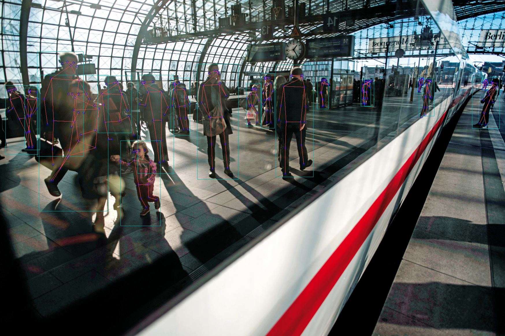

# TechTrasse

TechTrasse is a Deutschland 4.0 hackathon project created for the Deutsche Bahn Future Rail challenge. The idea is simple: railway stations already have cameras, but in everyday operations they are often used retrospectively, after something has happened. TechTrasse asks what would happen if that same visual infrastructure could become an active, real-time support system for safer, faster, and more reliable passenger flow.

The project focuses on one very human bottleneck in rail operations: boarding and changing trains. People cluster around a few doors, block passengers who are trying to get off, hesitate in dense groups, or miss connections even when the timetable technically contains enough buffer. These small moments add up. A few delayed doors can disturb a train's dwell time; a few slow transfers can ripple through an entire journey.

TechTrasse turns camera images into operational signals. It detects people, follows their movement through a scene, estimates whether they are entering or exiting, and uses that understanding to imagine live station feedback: audio announcements, platform displays, visual nudges, and eventually door-position guidance that helps passengers distribute themselves before the train arrives.

## The Challenge

Deutschland 4.0 invited students, researchers, and startups to develop digital innovations around real societal and industrial challenges. Team TechTrasse worked on the Future Rail topic with a Deutsche Bahn framing: how can digital systems make rail operations more reliable, scalable, and passenger-friendly by 2030?

The team's answer was not to invent an entirely new railway from scratch. It was to make better use of systems that already exist. Cameras, speakers, platform signs, operational data, and passenger-flow knowledge are already part of the railway environment. TechTrasse combines them into a feedback loop.

The project was developed by Team TechTrasse:

- Shankar Kumar
- Matthias Eckert

The team brought together computer science, machine learning, data science, and a business-engineering view of how a solution could be adopted pragmatically inside a railway context.

## The Core Idea

TechTrasse uses computer vision to understand where people are on a platform or near train doors. It watches for the kinds of patterns that slow down boarding:

- groups forming in front of only one or two doors
- passengers blocking the exit path for people leaving the train
- door areas becoming overloaded while nearby doors remain underused
- risky situations near platform edges or in dense crowds
- movement patterns that indicate whether people are entering or leaving

Once the system understands the scene, it can help passengers move differently. The feedback does not need to be complicated. It could be a spoken announcement asking passengers to use other doors, a visual cue on a display, an arrow on the floor, or a capacity indicator showing which door areas are currently crowded.

The result is a digital assistant for station flow. It does not replace railway staff, infrastructure planning, or timetable design. It gives the station a live sense of what is happening at the doors and a way to respond before small delays become larger ones.

## Why It Matters

Railway reliability is often discussed in terms of trains, signals, tracks, and rolling stock. TechTrasse looks at the passenger as part of the operational system. A train can be ready to depart, but if boarding is uneven or the exit path is blocked, the train still waits.

The project targets several connected outcomes:

- shorter and more predictable dwell times at stations
- better distribution of passengers along the platform
- fewer blocked doors during boarding and alighting
- stronger data about transfer behavior and station congestion
- earlier recognition of safety-critical situations
- better use of existing camera and speaker infrastructure

In the hackathon submission, the team framed the work around "low hanging fruits" for a digital railway: not a giant replacement program, but a practical way to reuse existing infrastructure with machine learning and operational feedback.

## How The Prototype Works

The prototype is a computer-vision pipeline for passenger counting and movement analysis. It processes a video frame by frame and turns each frame into three layers of understanding.

First, it detects people in the image. The YOLO model looks for objects and keeps only the detections classified as `person`. This gives the system a set of bounding boxes around visible passengers.

Second, it tracks each person over time. Deep SORT compares detections across frames and assigns persistent IDs, so the same person can be followed even as they move. This matters because counting people from a single frame is not enough; the system needs to know direction, continuity, and whether a person has already been counted.

Third, it interprets movement against a virtual line. In the train-door prototype, a line is drawn across the video. When a tracked person crosses it in one direction, the system counts them as entering; when they cross in the other direction, it counts them as leaving. The frame is annotated with IDs, centroids, the counting line, and live totals for "People Count In" and "People Count Out."

The notebook exploration extends this idea with human pose estimation. Rather than only drawing boxes around people, it estimates body keypoints using an HRNet pose model. That opens the door to richer interpretations of movement: posture, orientation, dense grouping, and interaction around train doors.

## What The Repository Contains

This repository preserves the hackathon prototype and the material around it.

The main prototype lives in `main.py`. It combines person detection, Deep SORT tracking, and line-crossing counts for passenger flow near a train door.

The detection layer lives in `yolo.py` and `yolo3/`. It wraps a YOLOv3-style model and filters the output down to people.

The tracking layer lives in `deep_sort/` and `tools/generate_detections.py`. This is the identity-tracking part of the system, using appearance features and motion prediction to keep stable IDs over time.

The counting and movement logic appears in `main.py`, with additional centroid-tracking support in `centroid_direction.py`.

The pose-estimation exploration lives in `hr_net_test_new.ipynb` and `additional_files/`. This notebook experiments with person boxes, SORT-style tracking, HRNet keypoints, and annotated output frames.

The `assets/` folder contains selected visual material from the hackathon package:

- DB-branded small GIFs used to give the README context
- reference station and passenger images
- demo output stills from the prototype
- small sample media retained for context

The `docs/` folder contains lightweight public project material:

- `project-submission-summary.md`, a cleaned public summary of the original submission
- `TechTrasse_Ekipa.pdf`, the finalist certificate/document

Large model weights, raw generated outputs, huge GIF exports, cache folders, and heavyweight drafts are intentionally not part of the repository history.

## The Product Vision

TechTrasse is not just a counting script. The code is the proof-of-concept layer for a larger operational idea.

In the envisioned system, station cameras observe platform zones around train doors. The computer-vision model estimates how many people are waiting, where they are waiting, and how movement is developing as a train arrives. A decision layer compares that live view with useful context: train type, expected door positions, current load, historical boarding behavior, and transfer pressure.

When the distribution is poor, the station responds. It might ask people to move further down the platform. It might show a door-capacity indicator. It might direct passengers away from a blocked entrance. In later versions, floor arrows or platform markings could support dedicated waiting and exit zones.

The important part is the feedback loop:

1. Observe passenger flow.
2. Detect crowding, imbalance, or risk.
3. Give passengers a clear nudge.
4. Measure whether the situation improves.
5. Use the result to make future station behavior smarter.

This makes the station more adaptive without expecting every passenger to understand the operational consequences of where they stand.

## Rollout Thinking

The original concept describes a phased rollout.

Phase 1 focuses on S-Bahn operations. This is the most practical starting point because door positions are more predictable and vehicle types are more consistent. The system can learn fixed platform-door zones, detect groups around those zones, and connect feedback to station loudspeakers or displays.

Phase 2 extends the idea to long-distance rail. This is harder because train types, stopping positions, and door layouts vary more. The system would need better prediction about where doors will stop, stronger platform guidance, and integration with train composition data.

Phase 3 imagines a broader station-wide flow system. With reliable door positions and richer passenger-flow models, visual nudging could become part of the station architecture: waiting zones, exit paths, boarding arrows, and capacity-aware platform displays.

The project's long-term view is a railway where passenger behavior is gently coordinated by real-time information, rather than corrected only after congestion has already formed.

## Additional Use Cases

The same camera-understanding layer could support more than boarding optimization. The submission identifies several adjacent possibilities:

- detecting incidents or emergency situations
- identifying dangerous behavior near platform edges
- triggering alerts when unusual movement patterns appear
- measuring transfer flows to improve timetable and station planning
- monitoring mask compliance during pandemic situations
- producing anonymized station metrics for capacity and advertising analysis

These are not all implemented in the prototype. They show why the passenger-flow layer matters: once the station can understand movement in real time, many operational and safety workflows become possible.

## Privacy And Responsibility

Any real deployment of a system like TechTrasse would need careful privacy design. The value of the project is in movement patterns, counts, density, and direction, not in identifying individual people. A production version should therefore favor privacy-preserving processing:

- process video as locally as possible
- avoid storing raw footage unless operationally required
- anonymize or aggregate movement data
- make retention rules explicit
- involve data protection stakeholders early
- communicate clearly to passengers what is being measured and why

The prototype uses person detection and tracking IDs to count movement through a scene. Those IDs are computational labels inside the video, not personal identities. A real railway deployment would need to preserve that distinction rigorously.

## What Was Demonstrated

The hackathon work demonstrated that the concept is technically plausible:

- people can be detected in station and train-door footage
- individual movement can be tracked across frames
- entry and exit counts can be estimated from line crossings
- pose estimation can enrich the interpretation of passenger movement
- the outputs can be visualized in a way that makes the concept understandable to non-technical stakeholders

The prototype also revealed the practical challenges that would shape a real product:

- camera angle and resolution matter
- lighting, occlusion, and dense crowds make tracking harder
- different stations and vehicle types require calibration
- door-position knowledge is essential for useful feedback
- privacy and data governance must be designed from the beginning

## Hackathon Context

TechTrasse was developed for Deutschland 4.0, an innovation project under the patronage of Dorothee Baer, then Minister of State for Digitization. The challenge invited digital ideas across topics such as health, sustainability, smart cities, logistics, mobility, education, work, security, and digital infrastructure.

Within that setting, TechTrasse chose a grounded mobility problem: make everyday rail operations more reliable by understanding and improving how people move through stations.

The project reached the finalist stage for its selected challenge.

## A Note On The Name

"TechTrasse" combines the language of railway corridors and digital infrastructure. A Trasse is a route, alignment, or path. The project is about making those paths smarter: not only the tracks trains run on, but the human paths passengers take through platforms, doors, and transfers.

## Repository Philosophy

This repository is meant to tell the story of the project and preserve the working prototype, not to act as a polished product package. It keeps the meaningful source code, selected evidence, and submission material together while avoiding unnecessary generated bulk.

The best way to read it is as a hackathon artifact with a serious idea inside it: existing station infrastructure, computer vision, and small nudges can work together to make rail travel feel smoother.
